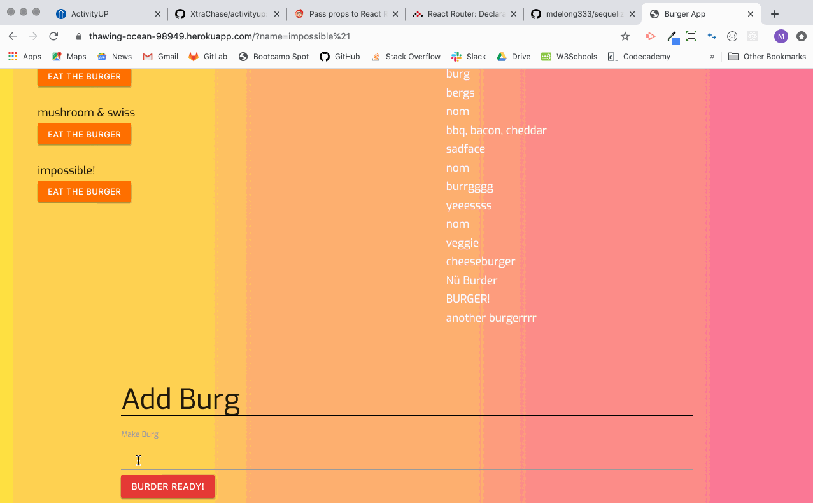

# sequelizedBurger
https://thawing-ocean-98949.herokuapp.com/

## Description

Burger App is a single-page app that allows users to add the names of burgers they'd like to eat and devour burgers once they've been added. It uses HandlebarsJS, MySQL database, and Sequelize.

## Instructions

1. Add the name of a burger you'd like to eat!
2. Click the eat button to eat it!!

## Tech used

* NodeJS
* Sequelize - ORM
* HandlebarsJS - templating language
* ExpressJS - Node framework
* NPM packages
* MySQL - database
